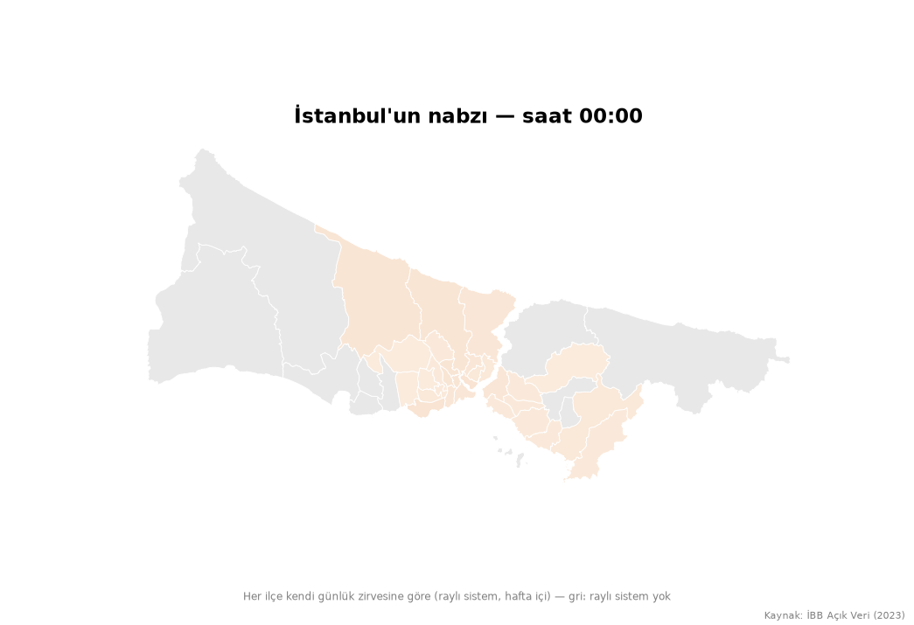
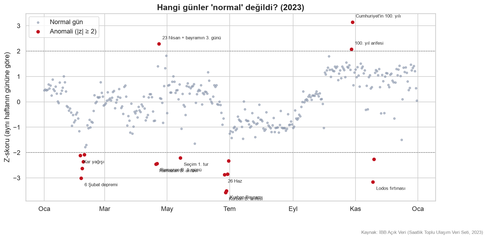
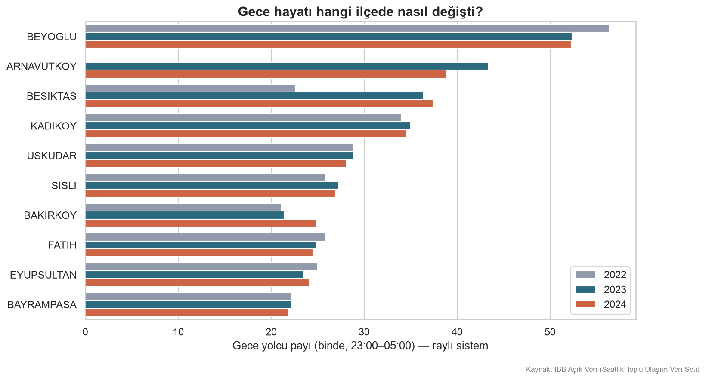
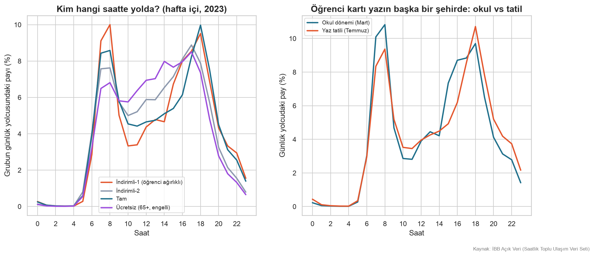
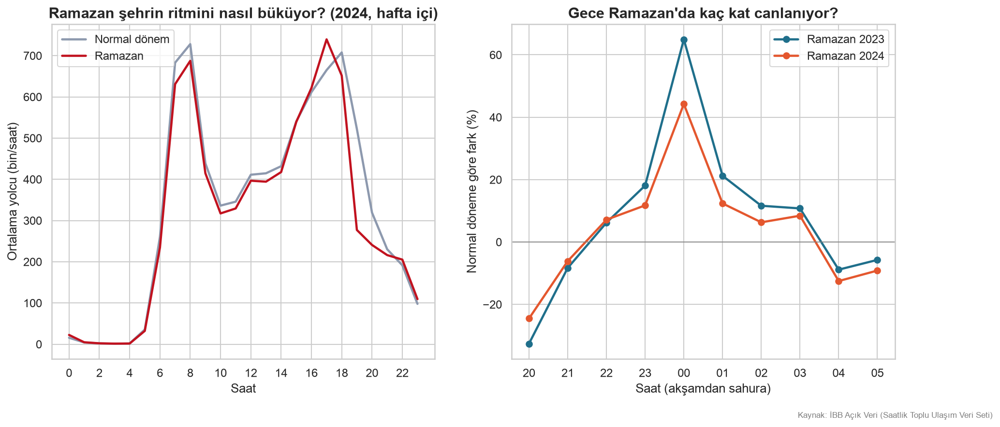

# İstanbul Analiz — Şehir Saat Kaçta Nerede Yaşıyor?



İBB'nin saatlik toplu ulaşım verisiyle İstanbul'un günlük ritmi.
**2022 – Temmuz 2024, 31 ay, ~475 milyon satır**; DuckDB + SQL window
functions + Python.

## Öne çıkan bulgular

- Şehrin kontağı 05:00'te çevriliyor: yolcu sayısı bir saatte **19 katına** çıkıyor.
- Hafta içi çift zirve (08 ve 18), hafta sonu 13:00 sonrası tek plato.
- **Gecenin başkenti Beyoğlu** (gece payı ‰52). İkinci sıradaki Arnavutköy'ün sırrı eğlence değil, M11 havalimanı metrosu.
- Metro açılışları veriden okunuyor: Arnavutköy gece ligine 2023'te girdi (M11), Beşiktaş ‰23'ten ‰36'ya çıktı (M7 uzantısı).
- 2023'ün anomalileri: 6 Şubat depremi, seçimler, bayram arifeleri, 18 Kasım lodosu. En pozitif gün: **Cumhuriyet'in 100. yılı** (z=+3.1).
- **"Emekli saati" gerçek:** ücretsiz kart (65+) sabah zirvesine katılmıyor, 10:00–16:00 arası kendi platosunu yaşıyor.
- **Ramazan geceyi %45–65 canlandırıyor** (iftar sonrası); sahurda artış yok — sahur evde geçiyor.
- Pazartesi sendromu veride yok. Gece 00:00'ın en kalabalık günü **Pazar** — Cumartesi gecesinin taşması.
- 313 raylı istasyon 4 ritim tipine ayrılıyor: sabah zirveli "yatak odası" duraklar, akşam zirveli iş merkezleri, karma ve dengeli tipler.

## Grafikler


*İstanbul kaçta uyanıyor, kaçta yatıyor?*


*Hangi günler "normal" değildi? (z-skoru, aynı haftanın gününe göre)*


*İlçelerin gece yolcu payı (raylı sistem)*


*Üç yılda gece hayatı — metro açılışlarının izi*


*Kim hangi saatte yolda? Öğrenci, tam, ücretsiz*


*Ramazan'ın saatlik imzası*

İnteraktif: `ciktilar/haritalar/gece_haritasi_2023.html` (ilçe choropleth) ve
`ciktilar/haritalar/ilce_saatlik_nabiz_2023.html` (saat kaydıraçlı) — indirip
tarayıcıda açın. Tüm yılların grafikleri `ciktilar/grafikler/` altında.

## Veri

- Kaynak: [İBB Açık Veri — Saatlik Toplu Ulaşım Veri Seti](https://data.ibb.gov.tr/dataset/hourly-public-transport-data-set)
- Veri repoda yok (`data/` gitignore'da): aylık CSV'leri portaldan indirip
  `veri/ham/hourly_transportation_YYYYMM.csv` adıyla koyun.
- Portaldaki bazı dosyalar eksik (ör. Ağustos 2024 sonrası) — her dosya
  önce doğrulanır. Kolonlar ve tuzaklar: [`veri/VERI_SOZLUGU.md`](veri/VERI_SOZLUGU.md)

## Çalıştırma

```bash
python3 -m venv venv && source venv/bin/activate
pip install -r requirements.txt

python scriptler/validate_csv.py veri/ham/*.csv   # doğrula
python kaynak/ingest.py                            # CSV → Parquet
python scriptler/make_figures.py 2023             # yıl grafikleri
python scriptler/make_gece_haritasi.py 2023       # ilçe haritası
python scriptler/compare_years.py                 # yıllar arası kıyas
python scriptler/ozel_analizler.py                # kart tipi, Ramazan, günler
python scriptler/make_gif.py 2023                 # animasyonlu harita
```

## Yapı

```
├── defterler/   # veri keşfi (otopsi)
├── sql/         # numaralı DuckDB sorguları (window functions)
├── kaynak/         # ingest, db, viz
├── scriptler/     # validate, grafik/harita üreticileri
├── data/        # raw + processed (gitignore) + lookup tabloları
└── ciktilar/     # PNG, GIF, HTML
```

## Teknik notlar

- Ham CSV'ler pandas'a hiç yüklenmedi; filtre/aggregate DuckDB'de (19 GB → 1 GB Parquet).
- Window functions: `ROW_NUMBER`, `LAG`, hareketli ortalama, `AVG() OVER ()`, `FILTER`, `QUALIFY`.
- `town` kolonu otobüste garaj bölgesi gösterdiği için ilçe analizleri raylı sistemle sınırlı; M7'nin eksik ilçeleri `veri/esleme/` ile tamamlandı.
